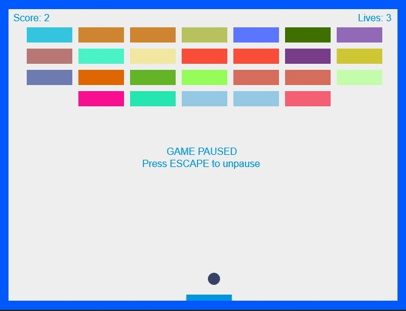
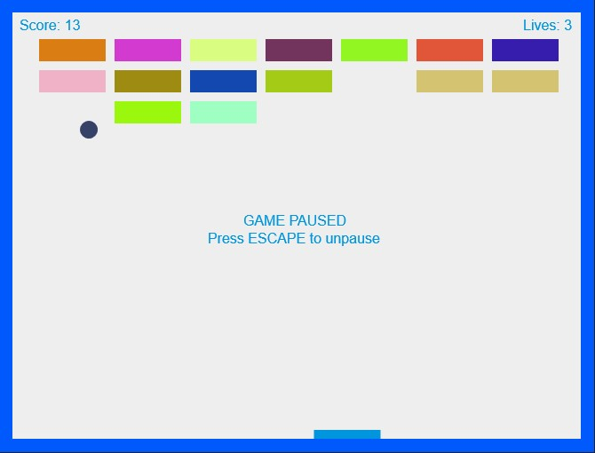

## About

You can play the game here: https://mike-2d-breakout.netlify.com/

This project was made so that I can practice mastering javascript module import / exports and generally to just sharpen my skills in javascript. I have almost completely re-written the code to be ES6 (Arrow funcs, let, const, etc). 

## Screenshots

## Credit

Original game source code from an old tutorial on MDN: https://developer.mozilla.org/en-US/docs/Games/Tutorials/2D_Breakout_game_pure_JavaScript

Sync gameloop to FPS functionality was from Rishabh: https://codetheory.in/controlling-the-frame-rate-with-requestanimationframe/

Function to get random hex color was found on stack overflow: https://stackoverflow.com/a/5092846
